# **P2P_MultiClient_Chat user manual**

### 1.0 GENARAL INFORMATION
###### 1.1 System Overview
This is a simple P2P multiclient chat system that can use local and remote server and can support multi users to log in. It using java.net library to communication and using javax.swing to build GUI.

###### 	1.2 System Requirement

For using this application, you need a system with gui environment, and it required a JRE runtime which version is jre1.8.0_144 or later, and if you want to use the remote server, you need connected to the Internet.

### 2.0 GUTTING STARTED
###### 2.1 Start server

To running a local server, you need to open the *P2P_Multi_Client_Chat_App.jar* file 

and choose to open as *Server*.

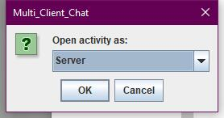

Then you will see a window to indicate that you have already started the server.

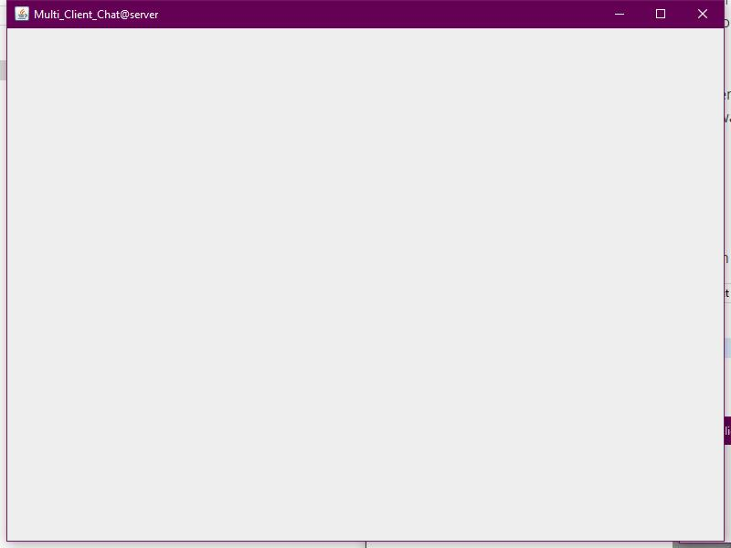

###### 2.2 System usage

To running the client, you need to pre-start a local server, or you can use a remote server provided by others(In the application has a pre-seted server), and in there, we use the pre-seted server to demonstrate.

First, we choose to open the client activity.

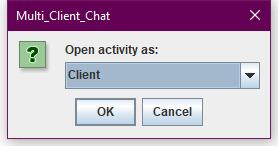

Then, we choose to login into the *Test Remote Server*

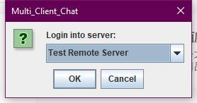

After successful connect to the server and enter your username,

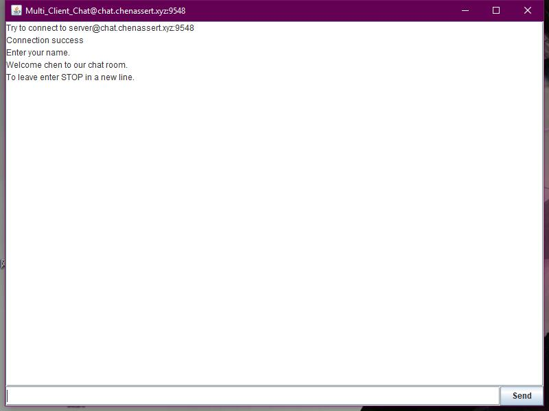

then you can enter your command freely.

First, you can enter *HELP* to see command list.

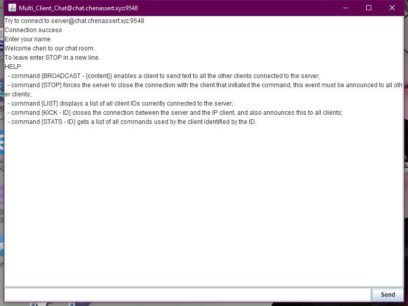

###### command EXP:

1. broadcast

   You can use {BRODACAST - {content}} to send broadcast to any other users.

   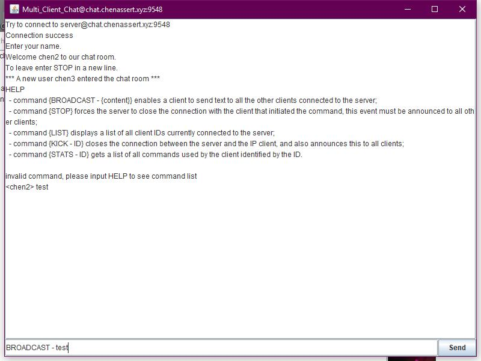

2. stop

   You can use {STOP} to close the connection.

   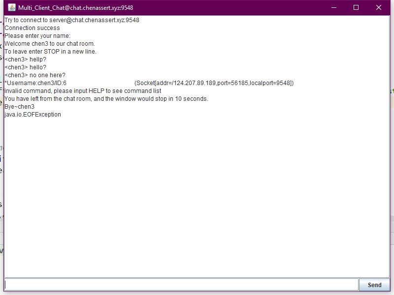

3. list

   You can use {LIST} to display all clients.

   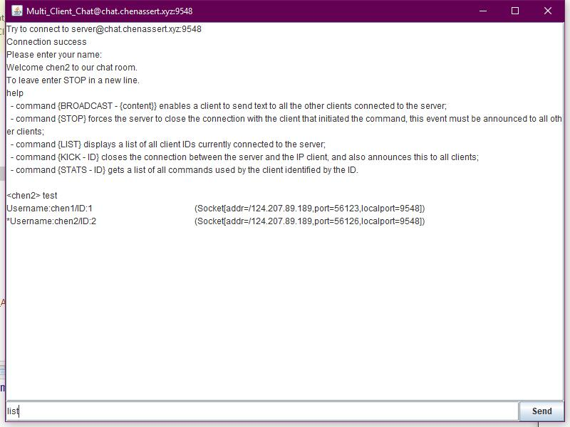

4. kick

   You can use {KICK - ID} to kick one user.

   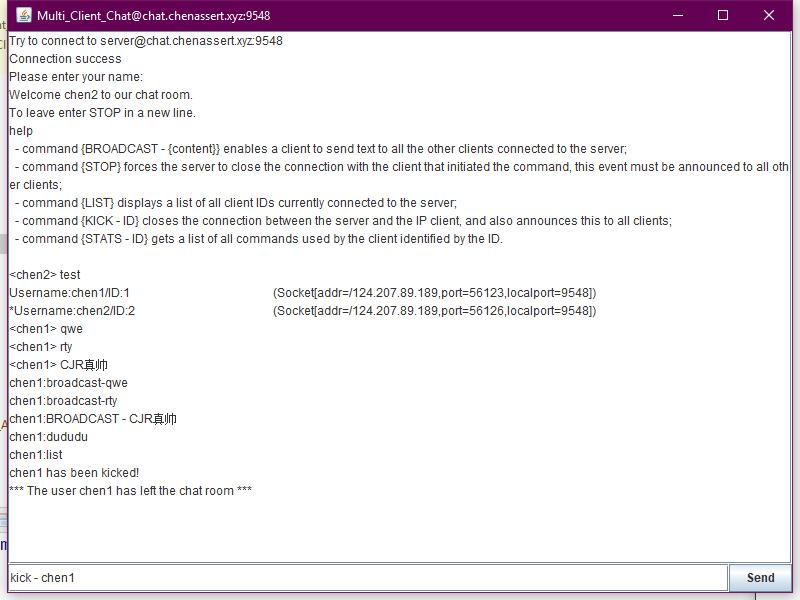

5. stats

   You can use {STATS - ID} to get a list a user's command history.

   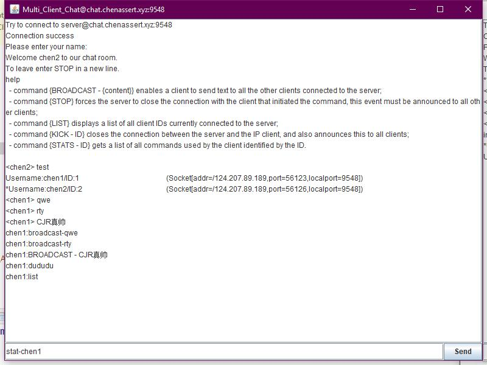

